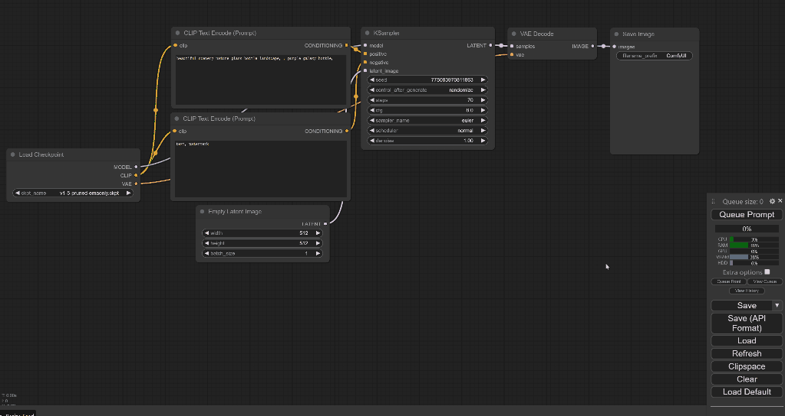

# ComfyUI-Catcat

ComfyUI-Catcat is an extension that transforms waiting times into a fun spectacle, injecting joy into ComfyUI renderings with random cat GIFs, making each loading moment an unexpected delight.



## Description

*Idea by Hyacinth, Built by Chenran (Actually GPT4)* 

Tired of waiting for rendering in ComfyUI? Me too!

ComfyUI-Catcat custom node dynamically displays a random cat GIF at the bottom left corner of the screen during queueing prompt within a ComfyUI application. 

It's designed to enhance user experience by providing a visual indicator of execution processes in a fun and engaging way. The extension listens for execution start and end events, showing a cat GIF when execution begins and hiding it once execution ends.

## Installation

To install, you can follow the following steps:

1. goto ComfyUI/custom_nodes dir in terminal(cmd)

2. `git clone https://github.com/jw782cn/ComfyUI-Catcat.git`

3. Restart ComfyUI

## How to Use

No worry! Just run your workflow and you will see random cats!


## How to Add More Cat GIFs

To customize the ShowCat extension with more cat GIFs, follow these steps:

1. **Add GIF Images**:
   - Place your GIF images into the `web/images` directory of your project. Ensure your images are appropriately sized and optimized for web use.

2. **Update the Cat GIF Paths**:
   - Open the `cat.js` file (or wherever your extension script is located).
   - Locate the `gifFilenames` array.
   - Add the relative path to your new GIF images within this array. For example, if you added `cat_6.gif` to the `web/images` directory, update the array as follows:

```javascript
const gifFilenames = [
    "images/cat_1.gif",
    "images/cat_2.gif",
    "images/cat_3.gif",
    "images/cat_4.gif",
    "images/cat_5.gif",
    "images/cat_6.gif", // Newly added image
];
```

## Update
[03/08] add drag and drop, resize

## Disclaimer
This extension simply provides funs and does not guarantee their proper functioning.

## Credit
Thank you [ComfyUI](https://github.com/comfyanonymous/ComfyUI)!!!